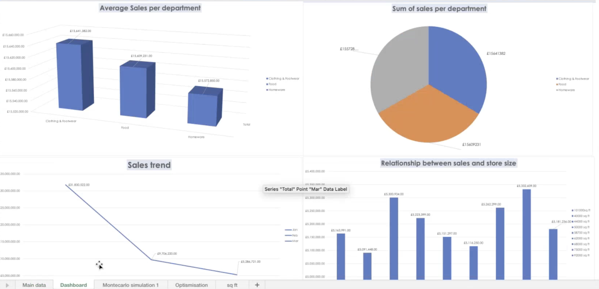
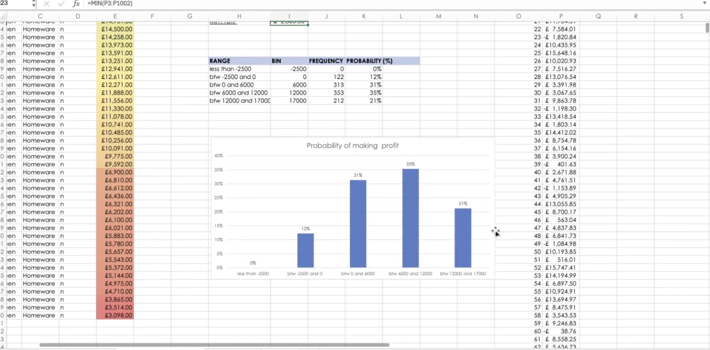

# Retail-Analytics-Operational-Optimization-M-S-Scotland-Case-Study
As a Business Analyst consultant for Marks &amp; Spencer, I developed an end-to-end analytics suite for the Regional Directors of Scotland. The project transitioned raw, "big data" into actionable insights across nine retail locations, focusing on sales performance, profitability risk modeling, and supply chain cost-minimisation.
---

## 📊 Project Visuals

### 1. Data Cleaning & Descriptive Statistics

### 2. Executive Dashboard & Sales Analysis

### 3. Risk Modeling (Monte Carlo Simulation)

### 4. Logistics Optimization (Linear Programming)

