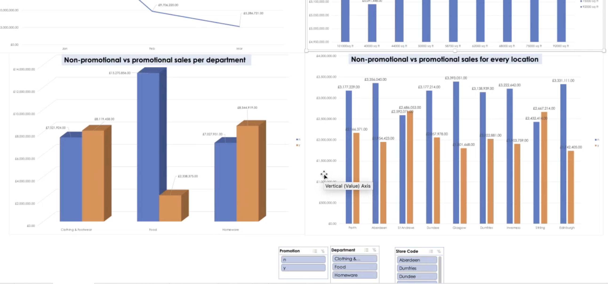
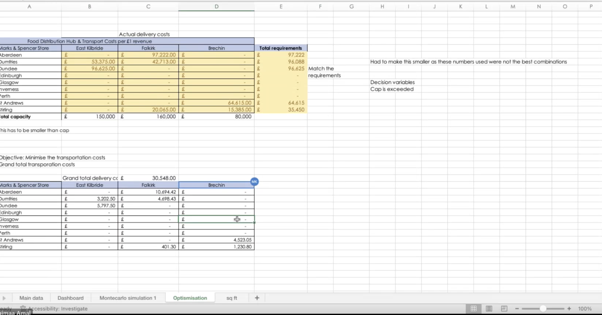

# Retail-Analytics-Operational-Optimization-M-S-Scotland-Case-Study
As a Business Analyst consultant for Marks &amp; Spencer, I developed an end-to-end analytics suite for the Regional Directors of Scotland. The project transitioned raw, "big data" into actionable insights across nine retail locations, focusing on sales performance, profitability risk modeling, and supply chain cost-minimisation.
# Retail Analytics & Operational Optimization: M&S Scotland Case Study

## 📌 Project Overview
This project serves as a comprehensive business analytics solution developed for the Regional Directors of Marks & Spencer, Scotland. By leveraging raw sales data from nine separate store locations, I built an end-to-end analytical suite to improve decision-making across sales performance, risk management, and logistics.
> 📥 **Download the File:** [MS_Scotland_Retail_Analytics_Model.xls](MS_Scotland_Retail_Analytics_Model.xlsb)
> > 📥 **Download the File:** [MS Scotland Retail Analytics Model](./MS_Scotland_Retail_Analytics_Model.xls)

## 🛠️ The Technical Workflow

### 1. Data Integrity & Descriptive Statistics
**The Problem:** Raw sales data often contains "noise" or entry errors that can lead to incorrect business conclusions.
**The Action:** I performed a rigorous Exploratory Data Analysis (EDA) and data sanitization process. By identifying and removing extreme outliers, I reduced the Standard Deviation from a skewed **£220,293** to a statistically valid **£18,272**.
**The Result:** Established a clean, reliable dataset that ensures all regional reporting reflects actual store performance rather than data anomalies.

---

### 2. Executive Dashboard & Sales Analysis
**The Problem:** Directors needed a way to quickly compare departmental performance across different regions and promotional cycles.
**The Action:** I developed a dynamic Excel-based dashboard focusing on:
* **Departmental Performance:** Comparing Food, Homeware, and Clothing & Footwear.
* **Promotional Impact:** Identifying which departments see the highest "lift" during sales events.
* **Store Scale:** Analyzing the correlation between store square footage and revenue.
**The Result:** A "single pane of glass" that allows directors to identify underperforming stores and high-ROI promotional categories at a glance.

---

### 3. Risk Modeling (Monte Carlo Simulation)
**The Problem:** The **Aberdeen Homeware** department has a high daily overhead of £4,250. Management needed to know the probability of failing to meet this cost.
**The Action:** Using non-promotional sales data, I built a **Monte Carlo Simulation (1,000+ iterations)**. I modeled profit outcomes with fluctuating gross margins between 60% and 70%.
**The Result:** The model identified an **88% probability of daily net profit**. This provides a statistical safety net for budgeting and risk management decisions.

---

### 4. Logistics & Supply Chain Optimization
**The Problem:** Transportation costs from northern distribution centers to retail stores were unoptimized, leading to potential waste in the delivery budget.
**The Action:** I utilized **Linear Programming (Excel Solver)** to minimize the total grand delivery cost. The model balances the supply capacity of three distribution hubs (East Kilbride, Falkirk, and Brechin) against the specific demand requirements of nine stores.
**The Result:** Successfully minimized transportation overhead to a grand total of **£30,548**, providing an optimized route and supply plan for the logistics team.

---

## 📈 Technical Skills Demonstrated
* **Data Sanitization:** Outlier detection and statistical validation.
* **Risk Management:** Probabilistic modeling and Monte Carlo simulations.
* **Operations Research:** Linear programming and cost-minimization (Optimization).
* **Business Intelligence:** Interactive dashboard design and data visualization.
This analysis assumes a normal distribution for sales; future iterations could incorporate seasonal seasonality and external economic trends for higher predictive accuracy.
---
## 🔍 Critical Awareness & Future Recommendations
While this model provides a robust baseline for Scottish regional operations, it is important to note:
* **Market Variables:** The Monte Carlo simulation assumes a normal distribution of sales. Future iterations should incorporate seasonal spikes (e.g., Christmas/Hogmanay) for more precise risk forecasting.
* **Logistics Constraints:** The optimization model assumes fixed transportation costs. Integrating real-time fuel price fluctuations would further refine the cost-minimization results.
